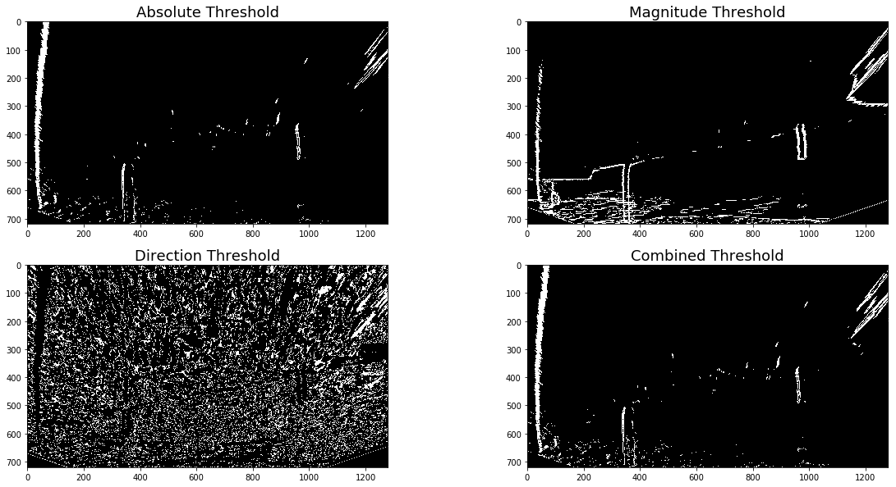

#**Advanced Lane Finding Project**

The goals / steps of this project are the following:

* Compute the camera calibration matrix and distortion coefficients given a set of chessboard images.
* Apply a distortion correction to raw images.
* Use color transforms, gradients, etc., to create a thresholded binary image.
* Apply a perspective transform to rectify binary image ("birds-eye view").
* Detect lane pixels and fit to find the lane boundary.
* Determine the curvature of the lane and vehicle position with respect to center.
* Warp the detected lane boundaries back onto the original image.
* Output visual display of the lane boundaries and numerical estimation of lane curvature and vehicle position.


## [Rubric](https://review.udacity.com/#!/rubrics/571/view) Points

### Here I will consider the rubric points individually and describe how I addressed each point in my implementation.  

---

### 1. Calibration

#### Using a series of images of a chessboard in order to compute the camera caliceration matrix and distortion coefficients.

1) Finding Corners
   
Firstly, I used the OpenCV functions findChessboardCorners() and drawChessboardCorners to find and draw the corners in several images of a chessboard pattern.


2) Distortion Correction

With the OpenCV function calibrateCamera(), object points(3D coordinate of real world) and images points(2D coordinate in a flat) to caculate the distortion parameters reprojection error, camera calibration matrix, distortion coefficient and rotation. Than, using the OpenCV function undistort() with caculated parameters to undo the effect of distortion of the chessboard images as a test.


### 2. Distortion correction to test image


#### Using the OpenCV function undistort() and caculated parameters (camera calibration matrix and distortion coefficient) to undo the effect of distortion of the test images.


### 3. Perspectiove Transform

1) Caculate perspective transform coefficient

Finding the same character points in both original and undistorted images, and using the OpenCV function getPerspectiveTransform(src, dst) with the finded points coornates to caculate perspective transform coefficient M. The selected character points and functions are:


| Source        | Destination   | 
|:-------------:|:-------------:| 
| 570, 470      | 320, 1        | 
| 722, 470      | 920, 1      |
| 1110, 720     | 920, 720      |
| 220, 720      | 320, 0        |

```python
M = cv2.getPerspectiveTransform(src, dst)
Minv = cv2.getPerspectiveTransform(dst, src)
```

2) Transform the undistorted image to bird eye view


### 4. Create the process with different thresholds to identify the lane lines.

#### Convert the warped images to different color space and gradient thresholded images, in order to find the lane line clearly.

1) Sobel, magnitude, direction and combined gradient thresholded binary image.

In this step, I defined the functions, which transfer the warped images to sobel thresholded binary images in x direction , magnitude thresholded binary images(sobel thresholded binary image in x and y direction), direction thresholded binary images(sobel thresholded binary image in direction of arctan(sobel_y/sobel_x)) and the combination of these 3 thresholded binary images. The processed image example are:


2) Color thresholded binary images.
   
In this step, I defined the functions, which process the warped images to L and S channel in HLS color space, B channel in LAB space, and the combination of these 3 thresholded binary images. Following are the processed image examples:


3) After comparation of the different gradients and color thresholded binary images. The gradients thresholded binary images perform not good in finding lane lins. B channel has good performance in searching yellow lane line. As well as L channel for white lane line. As a result, a combination of L channel and B channel color thresholded binary was selected to process the video later.

### 5. Find the lane lines boundry and measure curvature.

#### Find the lines wiht histogram peaks and sliding windows ployfit, and with continuous curved window ployfit.

1) Histogram peaks.

Use numpy.sum function to process the bottom half images from last step to find the lane lines position, where more pixel are white in x direction.


2) Sliding window ployfit

Define the function of find_lane_pixels(). With the result of Histgram peaks, the area of left and right lane lins can roughly be sure. Using a coloum of connected rectangles in y direction, which kann slid in x direction, to involve all the colored pixel in the middle of the rectangles in lane line areas.

Define fit_polynomial(). With the coornates of the colored pixel, using the numpy function polyfit() caculate the 2 order curved fit lines, which throuth most the colored pixels, such as the lane lines. The processed image example of these 2 step:


3) Define search_around_poly(). Using the finded 2 order curved fit lines with a certain margin to create 2 continuous curved windows. Using OpenCV function fillPoly() to color the 2 curved windows area, as the lane line area. And use OpenCV function addWeighted() to combine the fit line with the lane line area.


### 6. Curvature of the lane lines and vehicle positon with repect to center.

1) Caculate the curvature radius

In this step, I used the radius function with the unit 30/720 meter per pixel in x direction and 3.7/700 meter per pixel in y direction to caculate the radius of the 2 lane lines. And the average of the 2 radiuses is the curve radius of the lane.

Radius =​​ (1 + (dy/dx)**2)**1.5 / abs(d2y /dx2)

2) Caculate the offset.

Due to camera is located in the middle of the vehicle. So that the middle of the vehicle is located in the middle of the photo at bottom. The distance between the lane center  and the middle of photo in x direction at photo bottom is the offset.

### 7. Pipline of all the image treat processes.

In this step, I colored the selected lane with green on the grayscale bird eye view image with OpenCV function fillPoly() firstly. Secondly I inverse the processed image from last step to camera view with OpenCV function warpPerspective() and parameter Minv. Than combine the processed image with original image. Finally print the caculated radius and offset on the top of the image.

### 8. Input video in image treat process pipline.

In this step, I imported functions VideoFileClip from moviepy.editor and HTML from IPython.display. Than inported the project_video in the 2 functions to output the final treated video.

The output video: [link to my video result](./project_video_output.mp4)

---

### Discussion

In this project, I got much experience in image processing and programming with python. And I encountered several problems during this project.

1) The output video perform not pefect. Specially by other vehicle overtake on beside lane. I should try more combination of color space and gradient thresholds in order to get better performance in lane line finding. On the other hand, I should try to inport more coornate deteils in lane line finding, in order to avoid the effect of the overtake vehicle and shadows of trees and wall of the road.
2) To avoid the mistakes in programming. I should write a program draft before starting. It is easier to unify the variables types and names, and better for improving the work efficiency in programming. I encountered a problem in calling functions. Because the variable types of defined functions are different. I wasted much time to write the code with same functions in different defined functions. And correcting the variables types costed much time too.
3) There was a problem by processing images, because of the conflict of reading images with matplotlib.image.imread and OpenCV.imread. This problem should be avoided in the projects henceforth.
4) I am still not familier with python. So I did not use class function at the end of the project. I will learn the knowledge in this area in few days, and try to correct my code later.
   
My code performs not good in processing the challenge_video and harder_challenge_video. I will try to consummate my code in the coming days and process my code with the chanllenge_video.

